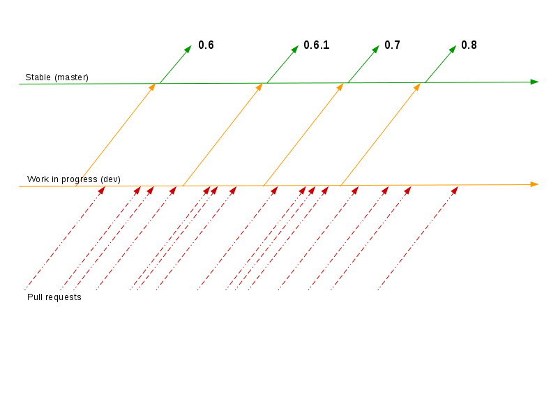
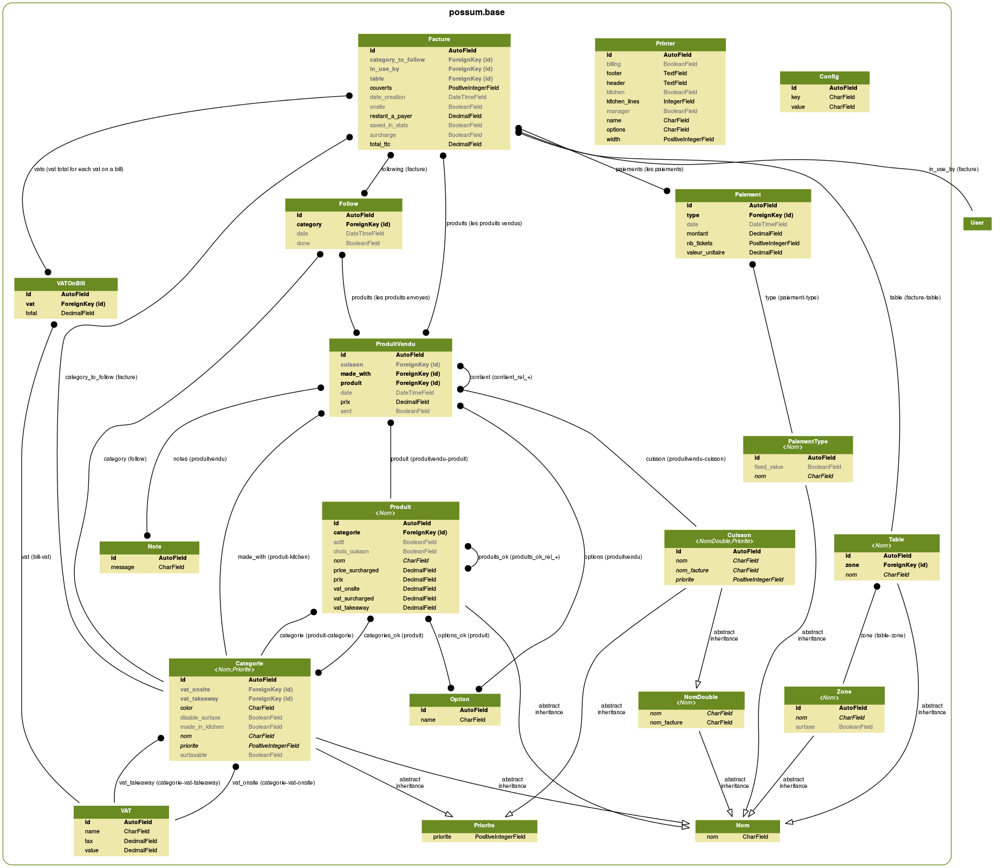
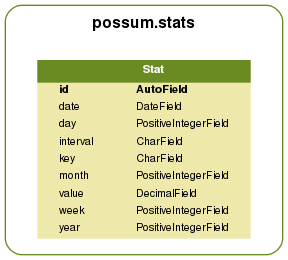

===========
Development
===========

The project is open to all contributions, the easiest way is to start by forking
the `project <https://github.com/possum-software/possum/>`_ on **GitHub**
and consult
tasks list: `Issues <https://github.com/possum-software/possum/issues>`_.

There are also some usefull tools to audit code:

* `Jenkins <http://jenkins.possum-software.org/>`_
* `Sonar <http://sonar.possum-software.org/>`_

Version number
==============

Here the development cycle adopted for release version:

An example for version 1.0:

* 1.0.rc?: additions of features are blocked, only bug fixes
* 1.0: stable version
* 1.0.1: only bug fixes on stable version

Coding convention
=================

The coding convention used for the project following the
`Style Guide for Python Code (PEP 8) <http://www.python.org/dev/peps/pep-0008/>`_.

Compliance with agreements is verified by Jenkins,
the results are available here:
`Jenkins <http://jenkins.possum-software.org/>`_.

In short:

* tabulation must be 4 spaces
* maximum line length: 79 characters (and 72 for docstrings/comments)

How to contribute
=================

Get started
-----------

Firstly, you must have an account on `Github <https://github.com>`_.

You have to create a fork `here <https://github.com/possum-software/possum>`_
(top right).

Now, you will use your fork. This is an example with my username
**sbonnegent**. Full documentation is on
`Github (fork a repo) <https://help.github.com/articles/fork-a-repo>`_.

In short::

  $ git clone git@github.com:sbonnegent/possum.git possum-sbonnegent
  $ cd possum-sbonnegent
  $ git fetch upstream

Launching a development server
-------------------------------

In order to launch a development server you can use 

::

  $ ./make update
  $ ./make run

The settings file that is used is settings.py. You may want to copy the content of 
settings_dev.py or settings_production.py in it to get the setting you want while 
running the command.

::

  $ cp possum/settings_dev.py possum/settings.py

Preparing your pull request
---------------------------

::

  $ echo "make changes and commit"
  $ git commit -a -m "cool stuff"
  $ git push

Your changes are clean in your fork, now you can create a pull request directly on Github.
All pull requests must be sync with Possum development branch (dev).

After that, you must check state of your request on
`Jenkins (pull_requests) <http://jenkins.possum-software.org/job/pull_requests/violations/>`_.
if the number of violations is up, your request will not be accepted.

You can fetch any new changes from the original repository and resync your fork with::

  $ git checkout master
  $ git pull git@github.com:possum-software/possum.git dev
  $ git commit -a -m "resync"

Change in class
===============

After any change in the definitions of models, it will
update patterns with South and demo data. This command
will do it for us:

::

  ./make migrations

Remenber to add new migration file on git.

How to update requirements version for virtualenv
=================================================

File **requirements.txt** defines all dependencies (and versions).
We must update this files regularly.

In short::

  $ # we enter in virtualenv
  $ source env/bin/activate
  $ # we check for available updates
  $ pip-review
  $ # we update
  $ pip-review --auto
  $ # we can test briefly with a shell
  $ ./make sh
  $ # and we create new requirements file
  $ pip-dump

Base
====

Main class in this part is Facture_.

Categorie
---------
.. automodule:: possum.base.models.category
   :members:

Config
------
.. automodule:: possum.base.models.config
   :members:

Facture
-------
.. automodule:: possum.base.models.bill
   :members:

Follow
------
.. automodule:: possum.base.models.follow
   :members:

Generic
-------
.. automodule:: possum.base.models.generic
   :members:

Location
--------
.. automodule:: possum.base.models.location
   :members:

Options
-------
.. automodule:: possum.base.models.options
   :members:

Payment
--------
.. automodule:: possum.base.models.payment
   :members:

Printer
-------
.. automodule:: possum.base.models.printer
   :members:

Produit
-------
.. automodule:: possum.base.models.product
   :members:

ProduitVendu
------------
.. automodule:: possum.base.models.product_sold
   :members:

VAT
---
.. automodule:: possum.base.models.vat
   :members:

VATOnBill
---------
.. automodule:: possum.base.models.vatonbill
   :members:

Stats
=====

.. automodule:: possum.stats.models
   :members:

